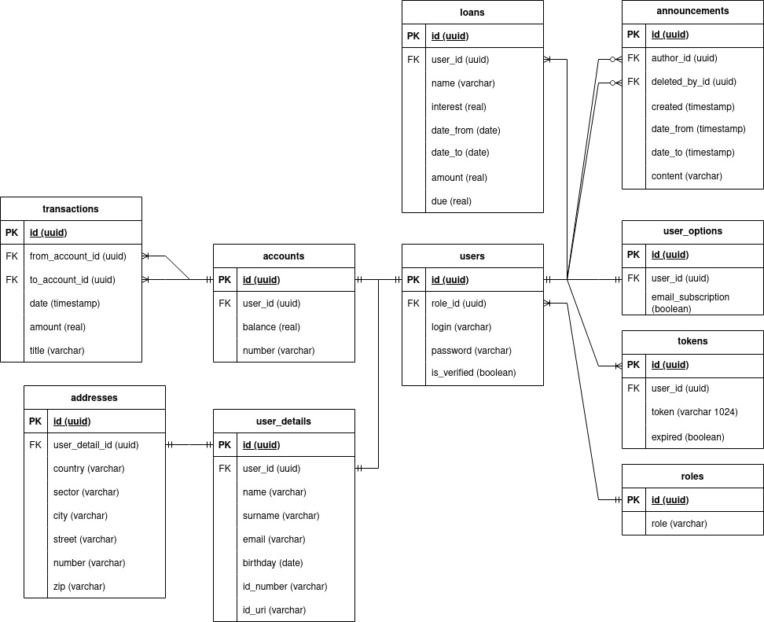

### Simple web application for banking system

#### Set up 
```docker build -t bank-server .```
```docker build -t bank-web -f Dockerfile-web .```
```docker compose up```

Go to:
http://localhost:5173

### Login data
Employee: empl empl
JohnS
SarahJ // have to be approved by an employee
DavidG
EmilyL // have to be approved by an employee


#### Database ERD diagram


