# Simple web application for banking system

## Technologies

### Backend 

* Java 17
* Spring boot 3.0.5
* Spring Data
* Spring security 
* Spring Web
* Hibernate
* Jakarta
* JWT
* Lombok
* Jackson

### Database
* PostgreSQL

### Frontend
* React
* Bootstrap

## Set Up

### Requirements
* Docker
* Internet connection
* Browser

### Setting up docker
```docker build -t bank-server .```

```docker build -t bank-web -f Dockerfile-web .```

```docker compose up```


## Running the app
Go to: http://localhost:5173

### Login data
Data in form: `login` : `password`
- Employees: 
    - `empl` : `empl`
- Clients (approved):
    - `JohnS` : `JohnS`
    - `DavidG` : `DavidG`
- Clients (unapproved - have to be approved by an employee to log in):
    - `SarahJ` : `SarahJ`
    - `EmilyL` : `EmilyL`

## Walkthrough

Login page:
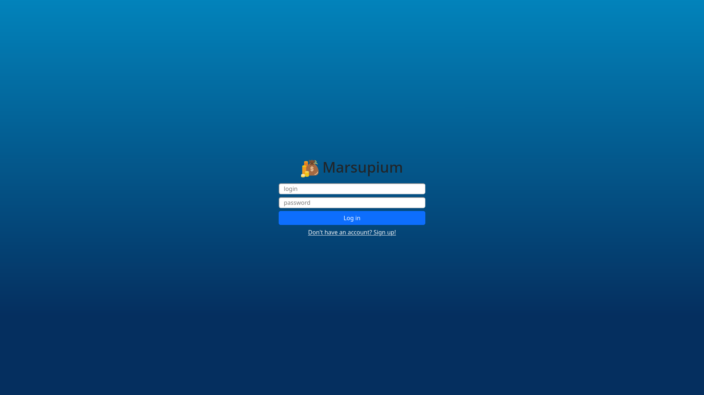

Let's create a new account:

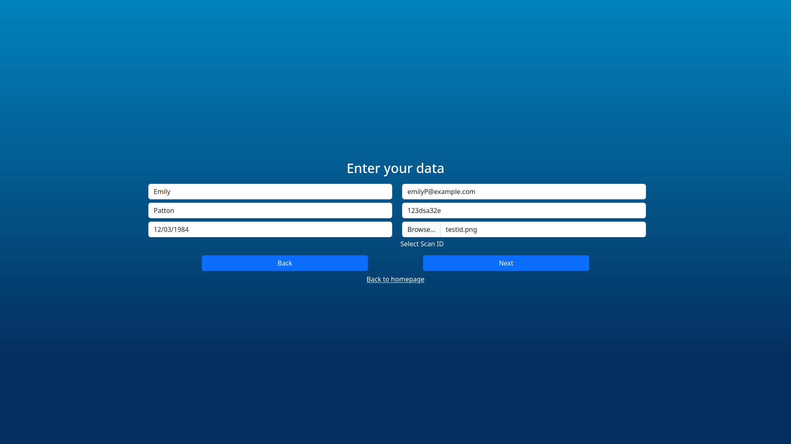

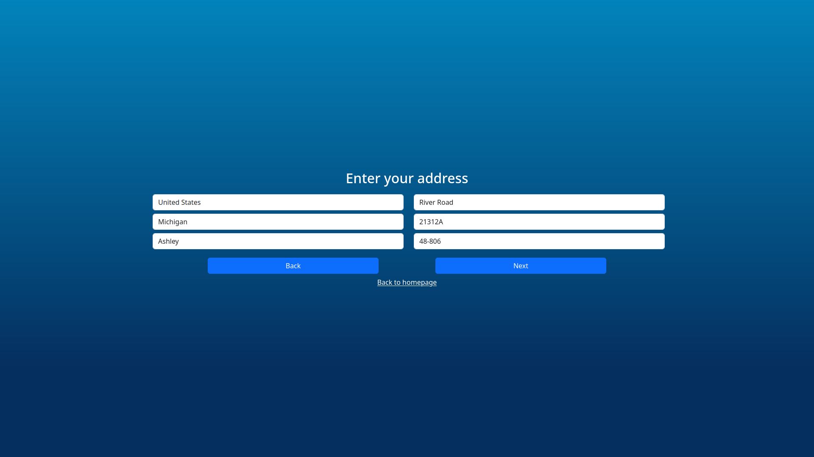

Please skip this page
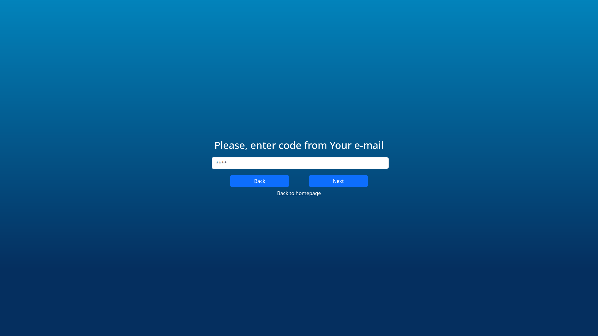

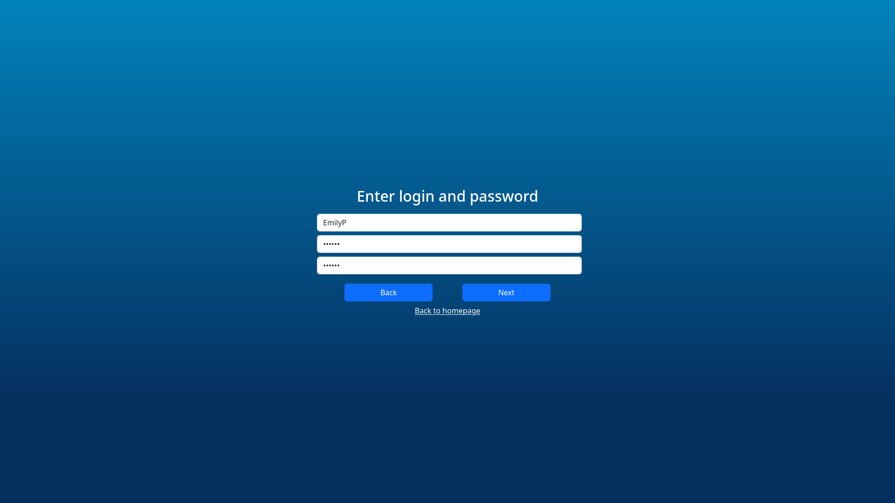

And done!
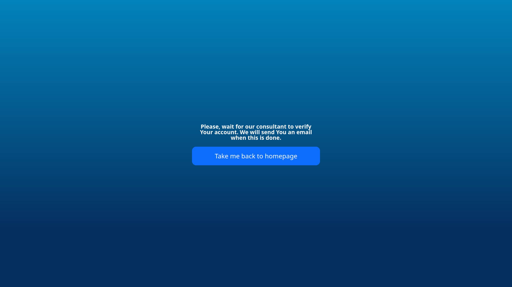


Now, log in to employee account


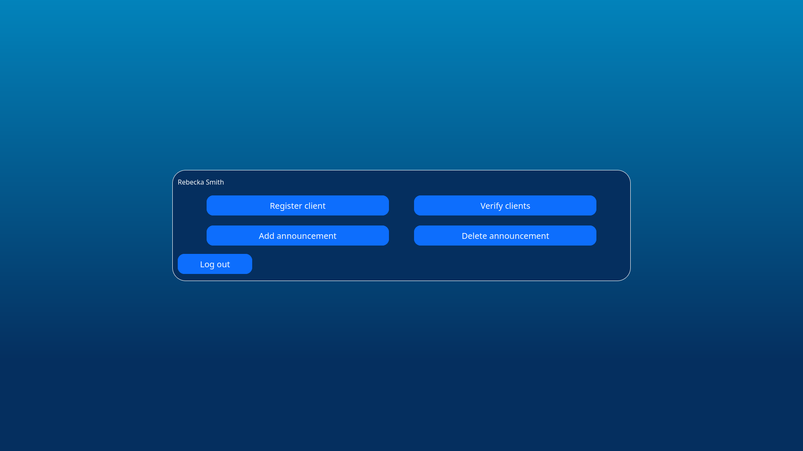

I will move to smaller screen

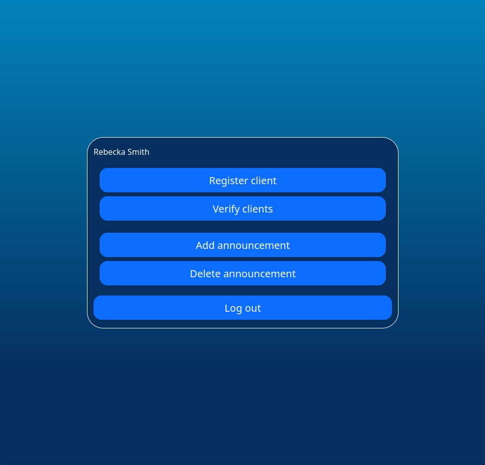

Click "Verify clients"

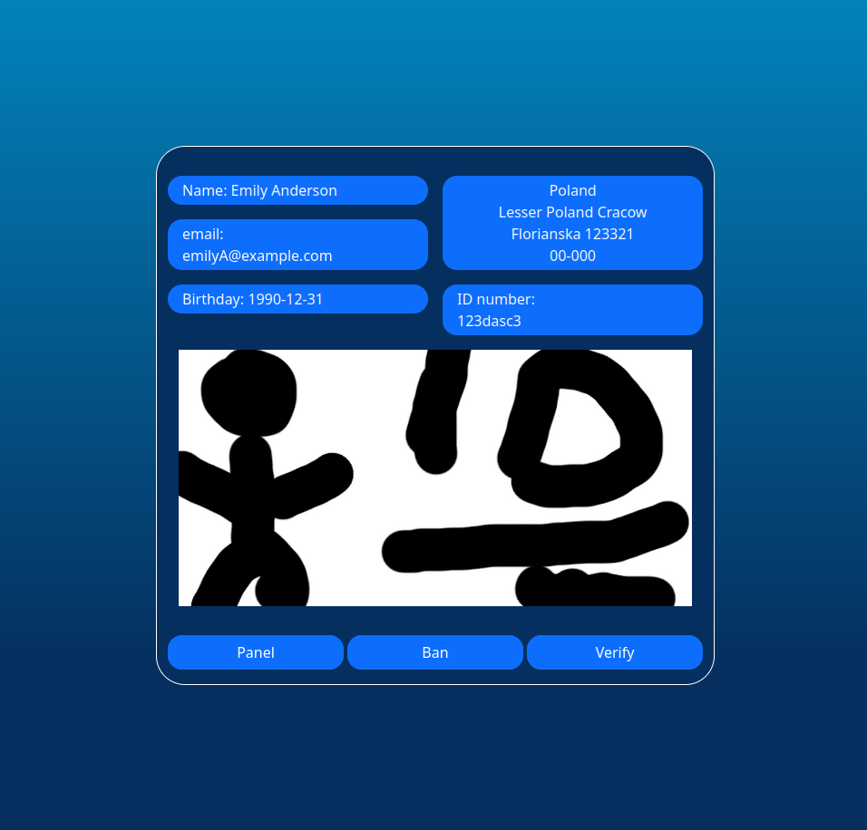

Choose to `ban` (and delete) account, or to positively `verify` them.\
! There is a bug - id will disappear, but data will stay in the window

Go back to panel and try to `add` new `announcement` - it will be visible from login page.\
! Too long  announcements will not be added 

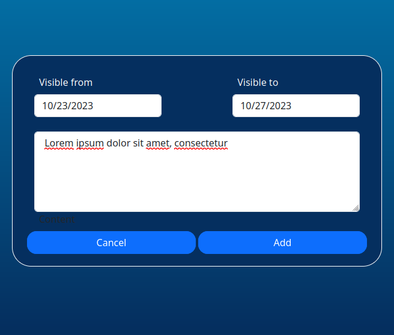

If you want, you can delete announcement. It will stay in the database, and will be marked with employee ID.
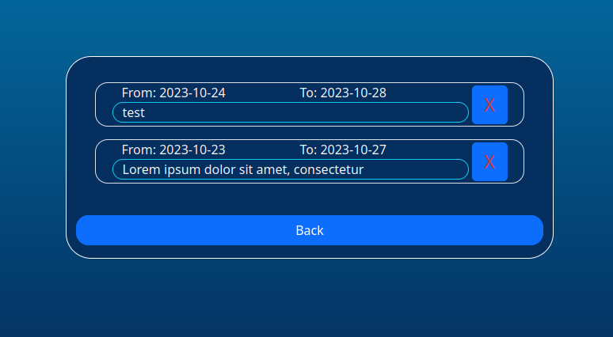

Log in to client account

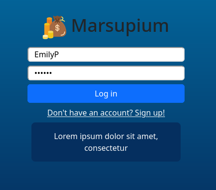

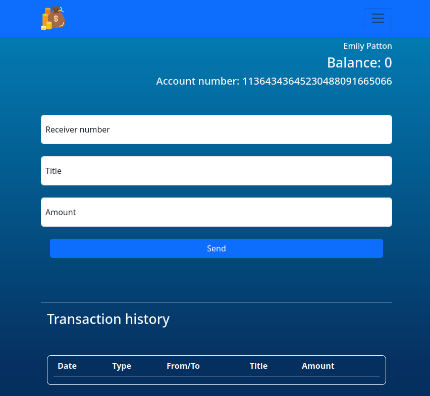

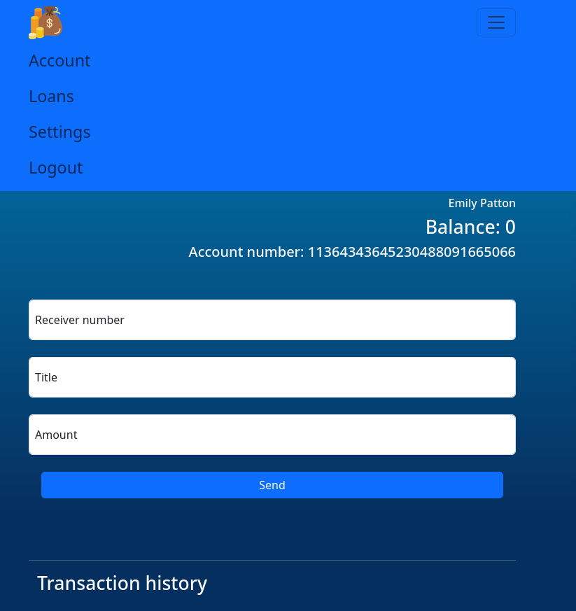

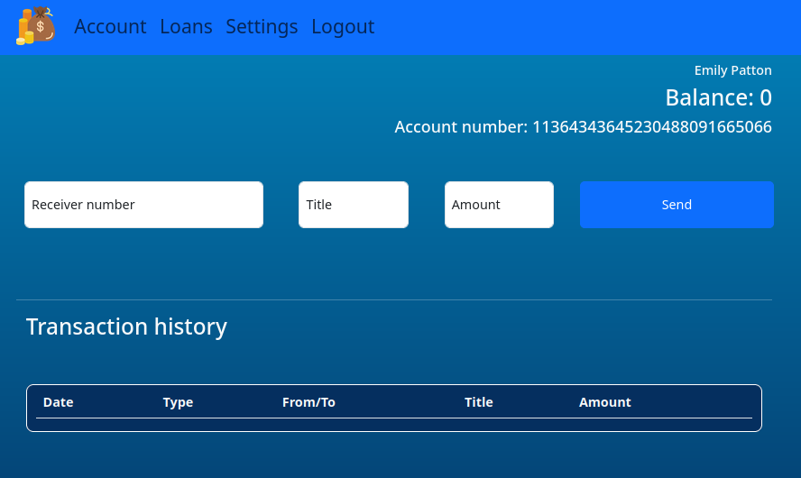

Let's take a loan! Don't You worry, I haven't implemented interest charging.
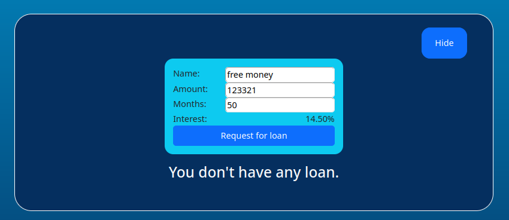

Copy account number and login to another account.

Paste account number\
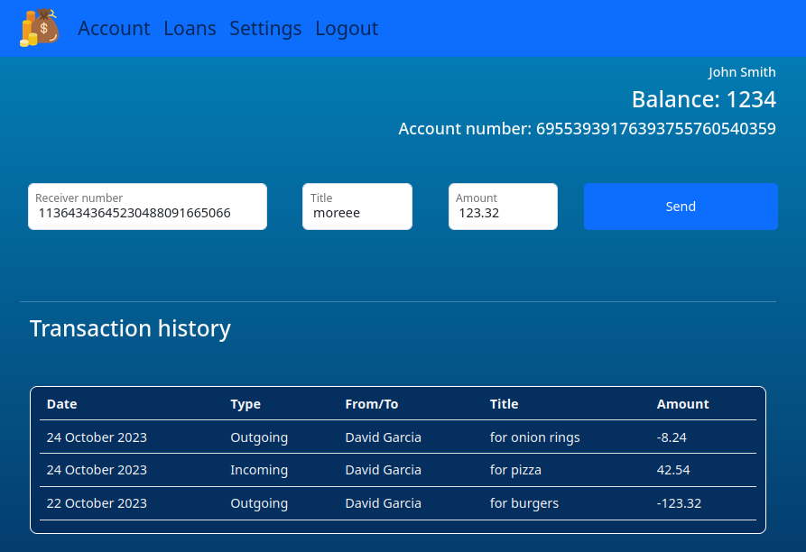

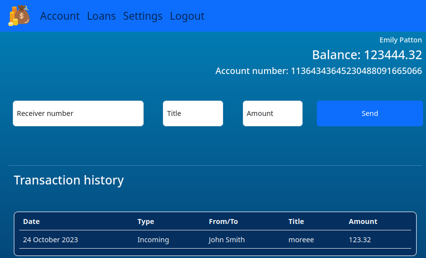


Setting, here you would be able to delete your account, but it is broken. Switch do, surprise, nothing.
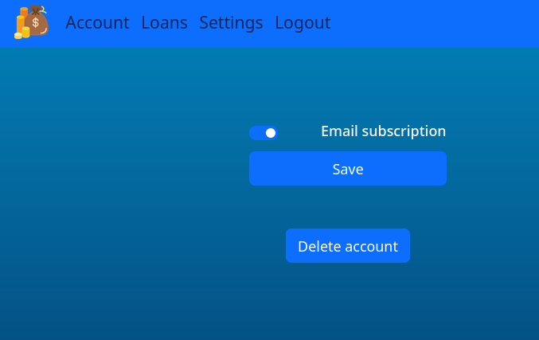

## Database ERD diagram


